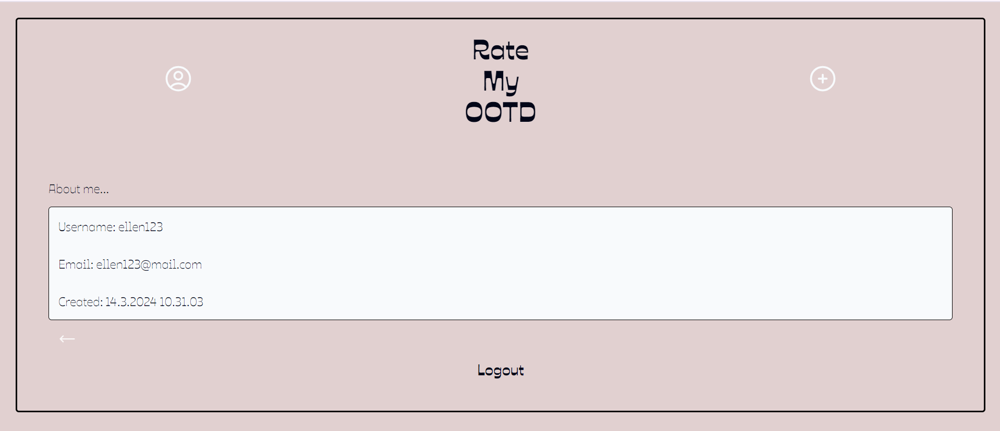
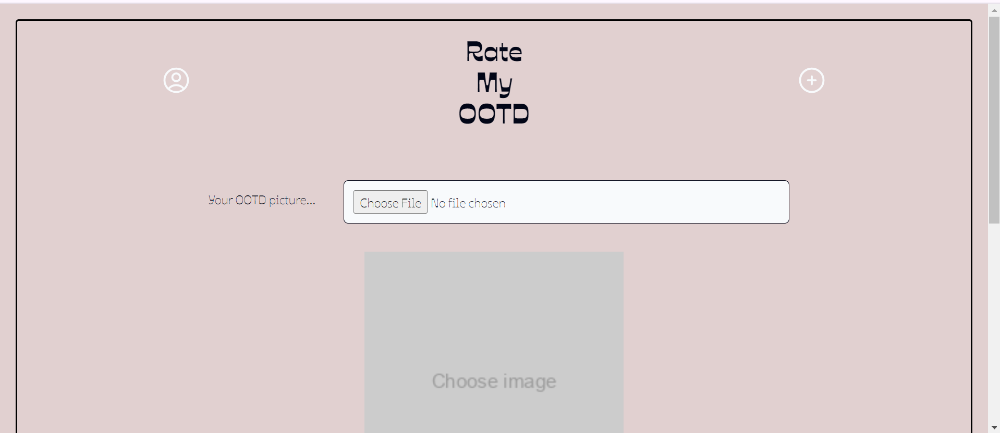
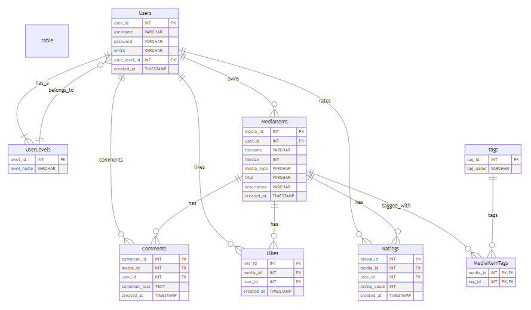

# Hybrid Apps - React project

Open [this link in browser](https://users.metropolia.fi/~ellenj/hybrid-yksiloprojekti) to see the app in action.

Screenshots of the working UI





Back-end provided by the teachers' example back-end servers.


Each user can own multiple media items but each media item belongs to one user (owns relationship).
Each user can comment, like, and rate multiple media items (comments, likes, and rates relationships).
Media items can have multiple comments, likes, and ratings.
Each user belongs to one user level (belongs_to relationship) but each user level can be associated with multiple users.
Media items can be associated with multiple tags via the MediaItemTags table (tagged_with relationship). Each tag can tag multiple media items.

List of functionalities:

- Login and registration functionalities are possible in the login view
- User information and the logout functionality are available on the profile page
- Uploads by other users are viewable on the front page feed
- Liking and commenting on posts is posssbile
- Viewing posts' description and comments is possbile in the single page view
- Uploading a photo along with a title and a description is possbile in the upload view

---

## React + TypeScript + Vite

This template provides a minimal setup to get React working in Vite with HMR and some ESLint rules.

Currently, two official plugins are available:

- [@vitejs/plugin-react](https://github.com/vitejs/vite-plugin-react/blob/main/packages/plugin-react/README.md) uses [Babel](https://babeljs.io/) for Fast Refresh
- [@vitejs/plugin-react-swc](https://github.com/vitejs/vite-plugin-react-swc) uses [SWC](https://swc.rs/) for Fast Refresh

### Expanding the ESLint configuration

If you are developing a production application, we recommend updating the configuration to enable type aware lint rules:

- Configure the top-level `parserOptions` property like this:

```js
export default {
  // other rules...
  parserOptions: {
    ecmaVersion: 'latest',
    sourceType: 'module',
    project: ['./tsconfig.json', './tsconfig.node.json'],
    tsconfigRootDir: __dirname,
  },
};
```

- Replace `plugin:@typescript-eslint/recommended` to `plugin:@typescript-eslint/recommended-type-checked` or `plugin:@typescript-eslint/strict-type-checked`
- Optionally add `plugin:@typescript-eslint/stylistic-type-checked`
- Install [eslint-plugin-react](https://github.com/jsx-eslint/eslint-plugin-react) and add `plugin:react/recommended` & `plugin:react/jsx-runtime` to the `extends` list
